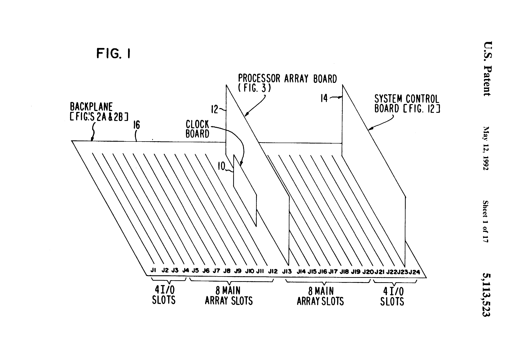
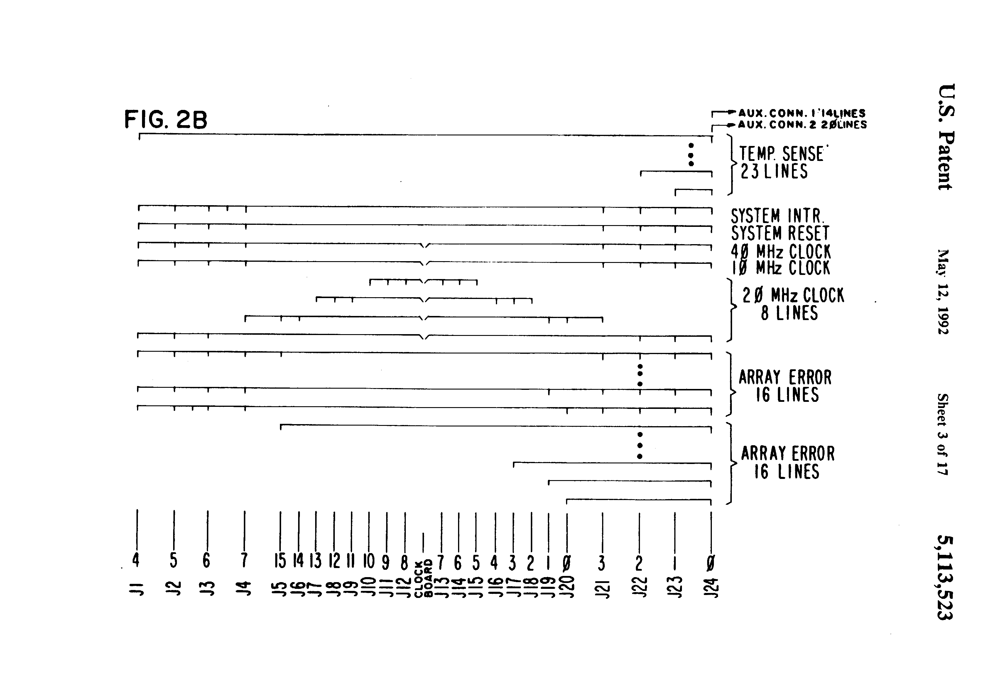
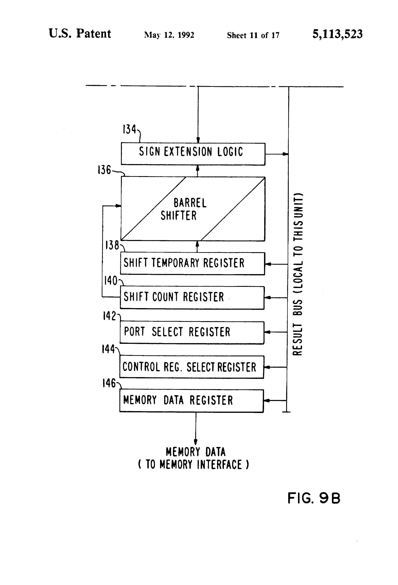
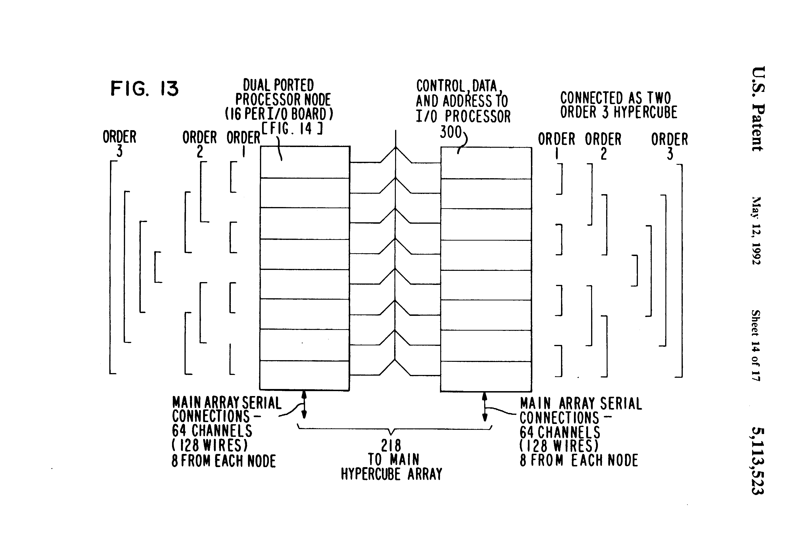

[Up](/)

# PART II. DATA PROCESSOR IMPLEMENTATION

# 8. MAJOR COMPONENTS

FIG. 1 is a diagram of a multiprocessing system in which the present
invention is embodied. A clock board (10), a number (1 to k) of processor
array boards (12), and a number (1 to x) of system control boards (14),
are plugged into slots (J1-J24) in a backplane (16). The backplane
(shown in FIGS. 2A and 2B) is wired in such a way as to interconnect the
k processors boards into an order P hypercube, where each processor board
has m processor nodes connected in an order n hypercube, and where K=2j,
m=2n, and P=j+n.

One of the processor array boards (12) is shown in more detail in FIG. 3,
and is described in Section 8.1. One of the system control boards (14)
is shown in FIG. 12, and is described in Section 8.9.

## 8.1 Processor Array Board

Refer to FIG. 3. Each processor array board is 16" by 21" and contains 64
processing nodes (i.e., m=64) each processing node having 128K bytes of
local memory and 11 I/O channels. The processing nodes are connected in
an order 6 hypercube on the board (i.e. n=6). This interconnection uses 6
of the 11 I/O channels on each processing node. The other 5 I/O channels
are brought to the edge of the board for access to the backplane. 4
of these 5 channels are routed via backplane interconnections to other
array boards to build larger hypercubes as described in Section 8.2 below.

The remaining one channel on each processing node is connected to one
of the eight I/O slots in the backplane which receive eight system
control boards. Thus each one of the eight system control boards (14)
in the I/O slots of FIG. 1 is able to communicate directly with up to
128 processing nodes.

One of the 64 processing nodes on the processor array board of FIG. 3 is
shown in FIG. 4. Each one of the 64 processing nodes includes an Ncube™
processor integrated circuit (30), a local memory (32), a system host
serial I/O channel (34), and 10 (i.e., p=10) serial I/O channels (36). The
wiring on the processor array board (shown in FIG. 3), interconnects
the 64 nodes on the board in an order 6 (n) hypercube comprised of 64
(2n =m) processing nodes. In the illustrative embodiment shown, the
wiring utilizes 6 (n) of the 10 (p) serial interconnect channels to
effect the interconnections among the nodes.

The Ncube™ processor block (30) of FIG. 4 is shown in more detail in
FIG. 5, and is comprised of Floating Point Unit (40), Address Unit and
Instruction Cache (42), Instruction Decoder (44), Integer Execution Unit
(46), I/O Ports (48), and Memory Interface (50), which are attached to
either or both of a common address bus (52), and data bus (54). These
units are described in sections 8.3 through 8.8 below.

## 8.2 Backplane Interconnections

FIG. 2a is a detailed diagram of the arrangement of the serial
communications interconnect on the backplane of the multiprocessing
system shown in FIG. 1. Processor array boards are inserted into one or
more of the 16 slots 0 through F to form hypercube structures according
to the following list:

* 1 board=order 6 hypercube (64 nodes)
* 2 boards=order 7 hypercube (128 nodes)
* 4 boards=order 8 hypercube (256 nodes)
* 8 boards=order 9 hypercube (512 nodes)
* 16 boards=order 10 hypercube (1024 nodes).

The backplane wiring routes signal lines to connect groups of boards
together as shown in FIG. 2A. For example, an order 7 hypercube is
achieved by inserting 2 boards in slots 0 and 1, or 2 and 3, or 4 and 5,
etc. An order 8 hypercube is achieved by inserting 4 boards in slots
0 through 3 or 4 through 7, etc. An order 9 hypercube is achieved by
inserting 8 boards in slots 0 through 7 or 8 through 15. An order 10
hypercube is achieved by inserting 16 boards in slots 0 through 15.

The I/O interconnect wires are shown at the bottom of FIG. 2A. Each
line includes 128 I/O channels which are connected from a system control
board in an I/O slot and fan out to up to 8 processor array boards, 16
channels going to one of the 8 boards. Each one of the 16 channels go
to the host serial channel (34), FIG. 4, on a processing node. Since
there are a total of 64 such nodes on a processor array board, four
system control boards in I/O slots 0 through 3 of FIG. 2A provide the
64 channels on each processor array board in array board slots 0-7,
and four system control boards in I/O slots 4-7 of FIG. 2A provide the
64 channels on each processor array board in array board slots 8-15.

FIG. 2b is a detailed diagram of the system control interconnect on the
backplane of the multiprocessing system shown in FIG. 1. The control lines
include system reset lines, clock lines, and array error lines. As shown,
the clock board (10) of FIG. 1 is inserted in a slot between slots J12
and J13.

## 8.3 Floating Point Unit

Refer to FIG. 6. The floating point unit (40) shown in FIG. 5 is
comprised of four input operand registers (56) which receive data
from the data bus (54). The operand select MUX (58) selects, from the
appropriate input operand register, the sign and exponent portion and
the significand portion. The sign and exponent portion is delivered to
the sign and exponent logic (60). The significand portion is delivered
to the significand logic (62). The logic blocks (60, 62) perform the
floating point arithmetic specified by the instruction definition in
Section 4.8. The sign and exponent logic (60) and the significand logic
(62) outputs are connected to the operand register (64) which returns
the data to the data bus (54).

## 8.4 Address Unit and Instruction Cache

Refer to FIG. 7 which is a detailed block diagram of the address unit
and instruction cache (42) shown in FIG. 5.

The refresh address register (100) contains a pointer to memory which is
the value of the address in memory which is to be refreshed next. After
each refresh cycle is taken, this pointer is incremented. The Stack
Pointer Register (102) contains a pointer which points to the top of the
stack. The stack pointer register is described in Section 4.2.2 above,
under General Registers. The operand address register (104) is an internal
register to which computed effective addresses are transferred before
a memory cycle is performed. The operand address register is connected
to the address bus.

The program counter (106) points to the next instruction to be
executed. It is incremented the appropriate number of bytes after the
instruction is executed. It is also affected by call, return, and branch
instructions which change the execution flow.

The program counter is connected to the instruction fetch address register
(108) which is a pointer into the memory location from which instructions
are currently being fetched. These instructions are loaded into the
instruction cache (114). The instruction cache allows for fetching
several instructions ahead of the instruction that is being executed.

The shadow ROM (110) is described in Section 4.9. It contains instructions
that are executed prior to the transfer of control to user code upon
system initialization. The instruction cache provides a buffer for data
prefetch and before the actual execution of the stored instruction. It
also provides some retention of the data after it has been executed. If
a branch is taken back to a previous instruction for reexecution, and if
that previous instruction is in within 16 bytes of the currently executing
instruction, the data corresponding to that previous instruction will
still be stored in the cache. Thus, a memory fetch cycle will not have
to be taken. The instruction cache is both a look-ahead and look-behind
buffer.

The MUX (112) is a multiplexer that multiplexes between instructions
coming from the shadow ROM or coming from memory after initialization.

## 8.5 Instruction Decoder

Refer to FIG. 8. The instruction decoder (44) shown in FIG. 5 receives
an instruction stream from the instruction cache of FIG. 7.

The instruction decoder includes an opcode PLA (101) which decodes
static information in connection with the opcode of an instruction,
such as number of operands, type of operands, whether the instruction
is going to take a single cycle to execute or many cycles to execute,
and what unit the instruction is going to execute in (the instruction
execution unit or the floating point unit). This information is latched
in the opcode latch (103). The operand itself is latched into the operand
latch (105). The operand sequencer PLA (107) is a state machine whose
main function is to supervise the decoding of operands. The operand
decode PLA (109) is a state machine whose main function is to compute
effective addresses for each of the addressing modes and to supervise
the execution of instructions. The execute PLA (111) is a state machine
whose main function is to execute the instruction in conformance with
the definition of instructions as given in Section 4.8 above.

## 8.6 Integer Execution Unit

Refer to FIGS. 9A and 9B which together comprise a detailed block diagram
of the integer execution unit shown in FIG. 5. The exact formats and
detailed descriptions of the registers are given in section 4.4.3. The
Processor Status Register (126) contains flags, interrupt controls and
other status information. The Fault Register (124) stores the fault
codes. The Configuration Register (120) stores the model number (read
only) and the memory interface parameters. The Processor Identification
register (122) contains a number that identifies the processor's
location in the array. The Timer register (116) contains a counter that
is decremented approximately every 100 microseconds and generates an
interrupt (if enabled) when it reaches zero.

The refresh timer (118) is a time-out register used to time the period
between refreshes. This register is initialized from eight bits out of
the configuration register and it decrements those eight bits. When the
timer goes to zero, a refresh is requested.

The register file (128) is described in Section 4.4.1 above. It includes
16 addressable registers that are addressable by the instruction operands.

The temporary register (130) is an internal register used during the
execution of instructions. It is connected to the integer ALU (132) which
is used during the execution of integer instructions. The sign extension
logic (134) takes the result from the ALU block and, according to the
data type of the result, extends the sign to a full 32-bit width. It
also checks for conversion overflows.

The barrel shifter (136), the shift temporary register (134), and the
shift count register (140) are used to execute the shift and rotate
instructions. The port select register (142) is an internal register in
which the register number of the serial I/O port to be selected for the
next operation is stored.

The control register select register (144) is an internal register
in which the address of the control register to be selected for the
next operation is stored. The memory data register (146) is an internal
register used for the temporary storage of data which is destined to be
written into memory. It is an interface register between the instruction
execution unit and the memory interface.

## 8.7 I/O Ports

FIGS. 10A and 10B comprise a composite block diagram of a single I/O
port representative of one of the 11 I/O ports (48) on each processor
shown in FIG. 5. Each port has all the circuitry necessary to both
receive and transmit serial messages. The format of the messages is
described in Section 5.4.1 above. Data are received on the serial data
in line (150) and are framed in the input shift register (152). The
information is then transferred in parallel to the input latch (154)
and is stored there until it is transferred to the memory on the memory
data in lines (156). Similarly, data to be transmitted is brought in
from the memory data out-lines (158), stored in the output latch (160),
and then transferred to the output shift register (162), and transmitted
serially on the serial out line and combined with parity bits from the
parity-bit generator (164). The input port and the output port both
contain an address pointer and a byte counter. The address pointers
(166, 170) point to the locations in memory where the message will be
written to or read from.

The input and output byte counters (168, 172) are utilized to specify
the length of message to be sent or received. All of these four registers
are initialized by the appropriate instruction: the load address pointer
instruction, and the load byte counter instruction. After a message
packet is received, the input address pointer (166) is incremented by
two bytes and the input byte counter (168) is decremented by the two
bytes. After a message packet has been sent, the output address pointer
(170) is incremented by two bytes and the output byte counter (172)
is decremented by two bytes.

The control portion of the serial port is shown in FIG. 10A. There is
an input controller (174) and an output controller (178) which control
the timing of the serial transmission. These controllers control the
timing of when the parity bits is sent out and when the parity bits is
to be checked on incoming data. They also control the various flags. The
parity error flag (180) is set by the input controller when there is a
parity error detected on an input message. The full flag (182) is set
by the input controller during the time that the input latch (154) is
buffering a message which has not yet been transferred into memory. The
overflow flag (184) is set by the input controller when the input latch is
holding a message to be sent to memory and the input shift register (152)
finishes receiving a second message which overrides the first message
before it is transferred to memory. The input enable flag (186) is a flag
which is both readable and writable by the user to enable interrupts
that occur when the input port becomes ready, i.e. when the byte count
goes to zero. On the output port there is an output enable flag (188)
which, when enabled, will generate an interrupt when the output port
ready line becomes true, i.e., when the byte count goes to zero (when
the message has been fully transmitted). This signals the user that it
is necessary to reinitialize the port with a new message. The full flag
(190) on the output port controller is set for the period of time when
there is data in the output latch which has not been transferred to
the output shift register. The broadcast flag (192) is initialized by
the broadcast count instruction. When this flag is set, it indicates
that this particular output port is a member of the current broadcast
group. When an output port is a member of the current broadcast group,
then any data coming over the memory data out bus (158) for broadcasting
will be transmitted out of this port and simultaneously out of all other
ports that have their broadcast flags on.

The port interrupt logic (194) generates interrupts if enabled when the
input or output ports have finished transmitting or receiving messages,
as signaled by the appropriate byte counter being decremented to zero.

The port memory arbitration logic (196) performs the function of
arbitrating for memory with all the other I/O ports. The winner of this
arbitration must again arbitrate with other units on the chip in the
memory interface unit described in Section 8.8. When an arbitration is
successful and a memory grant is given, the memory grant line indicates
that data either has been taken from the memory data in bus or that the
data is available on the memory data out bus shown in FIG. 10B.

## 8.8 Memory Interface

Refer now to FIG. 11, which is a block diagram of the memory interface
logic shown in FIG. 5. The memory interface logic interfaces between
the several internal units which need to access memory and the memory
itself. The memory control block (200) receives the memory request lines
from the various internal parts of the chip and memory requests external
to the chip via the memory request pin. (The memory request pin allows
the Intel 20286 to request a memory cycle of a processor's memory in
which case the memory interfaces logic performs the function of a memory
controller providing the RAM control lines from the timing generator
(202) while allowing the Intel 20286 to actually transfer the data in
and out of the memory).

The memory control prioritizes these requests according to a given
priority scheme and returns memory grants back to the individual
requesting unit when it is that unit's turn to use the memory. The memory
control specifies to the timing generator when access is to begin. The
timing generator provides the precise sequence of RAM control lines as
per the memory specifications for the particular RAM chip. The memory
control also specifies when the address is to be transferred from the
address bus through the address latch (204) to the address pins of the
memory chip. The memory control also controls the transfer of information
from the data collating registers (206) and the internal buses to and
from which data is transferred internally. The data collating registers
(206) perform two functions. First, they bring many pieces of a data
transfer together, for example, for a double-word transfer the registers
will collate the two single words into a double word. Second, the data
collating registers align the data with respect to the memory, such that
if data is being written to an odd location in memory the data collating
registers will skew the data to line up with memory.

The ECC check/generate logic (208) is used to generate the ECC during
a write operation and to check for errors during a read operation. The
ECC syndrome decode (210) operates during a read operation to flag the
bit position that is in error as determined by the ECC check logic. A
single-bit error can be corrected by the error correction code and
this bit position will be corrected automatically by the ECC syndrome
decode logic.

## 8.9 System Control Board

FIG. 12 is a detailed block diagram of the system control board (14)
shown in FIG. 1. It includes an array interface (212), shown in more
detail in FIG. 13, a 2MB System RAM (214), SMD disk drive controller
(216), parallel I/O interface (218), System I/O Interface (220), CPU
and Control (222), Auxiliary I/O Interface (224), and SBX and EPROM (226).

The address buffers (354) and the data buffers (356) are connected via the
data lines and the buffer lines to the local RAM (352). The SMD controller
(216) is connected to the local memory (352) and is also connected to
the system RAM (214) for the transfer of data from disk to memory.

## 8.10 System Array Interface

FIG. 13 is a detailed block diagram of the dual-ported processing nodes
and serial communications interconnect on the system control board array
interface shown in FIG. 12. The system control board includes r (r=16)
dual-ported processing nodes (300), connected on the board as shown in
FIG. 13.

As shown in FIG. 14, each dual-ported processing node includes a processor
(350), a local dual-ported memory (352) and s (s=3) I/O channels. The
channels are interconnected such that the s (s=3) channels (351)
communicate with other nodes on the system control board through the
order 1, order 2 and order 3 interconnect shown in FIG. 13 to form two
order 3 hypercubes. The 16 (r) dual ported processing nodes on an I/O
board are therefore connected as two order 3 hypercubes. The remaining v
(v=8) serial I/O channels (353) communicate with processing nodes on
array boards through host channels in the backplane I/O interconnect
shown in FIG. 2A.

FIG. 14 is a detailed block diagram of one of the 16 dual
ported-processing node of the system control board interface shown in
FIG. 13. The dual-ported processing nodes use the same NCUBE™ processor
integrated circuit as the array processor of FIG. 4.

## 8.11 System Node and Board Addressing

The System Control Boards (14) of FIG. 1 use the 8 I/O slots on the
backplane. Through backplane wiring, these boards are allowed to access
up to a 128 processor node subset of the array. Each System Control Board
(FIG. 13) has 16 processing nodes (300) and each node has 8 of its I/O
channels (0,1,...,7) dedicated to communicating with the Processing
Array through the array interface (212).

Referring to FIG. 1, let each Processor board slot J1-J24 be numbered
(xxxx) in binary. Also assume that the board in that slot contains
the hypercube (xxxx:yyyyyy) where yyyyyy is a binary number that can
range from 0 to 63. (i.e. the ID's of the processors on board xxxx are
xxxxyyyyyy where xxxx is fixed.) Then the following diagram illustrates
the mapping between the nodes in the Main Array and the nodes on a system
control board. ##STR53## Note the following from with respect to the
above chart:

* I/O slots 0,1,2,3 are connected to Processor Array slots 0,1,...,7
and I/O slots 4,5,6,7 are connected to Processor Array slots 8,9,..., 15.

* A node on a System control Board is connected to one processor
on each of the 8 Processor Array Boards that are on its side of the
backplane. Furthermore, the array node numbers that it is connected to
are the same modulo the board number. For example, node 1 on an I/O board
in slot 3 is connected to processors numbered 0xxx000111; or processor 7
(node 7 on Array board 0, processor 71 hex (node 7 on Array board 1, etc).

* A given channel number on all 16 nodes on a System Control Board is
connected to the same Array board. For example, all channels numbered 2
on a System Control Board are connected to processors on Array board 2
if the System Control Board is in slot 0,1,2,3 or 13 if it is in slot
4,5,6,7. By being connected to 128 processing nodes, a system Control
Board has a potential bandwidth of 280 Megabytes/sec.
